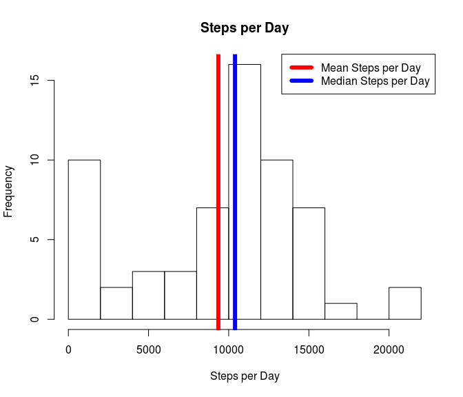
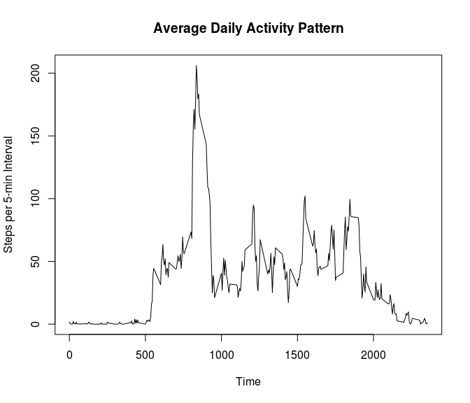
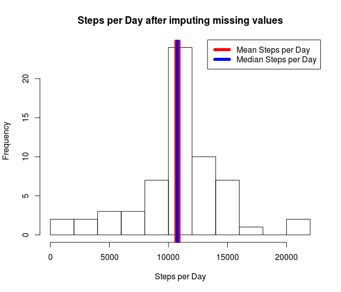

# Reproducible Research: Peer Assessment 1


## Loading and preprocessing the data
For loading and preprocessing I have chosen to use the dplyr library and the 
lubridate library (anticipating that there might be time-related issues further down)
I have also used lubridate to extract weekdays from the dates and generated an extra
column indicating whether a specific day was a weekend or not. 

```r
require("dplyr")
```

```
## Loading required package: dplyr
## 
## Attaching package: 'dplyr'
## 
## The following object is masked from 'package:stats':
## 
##     filter
## 
## The following objects are masked from 'package:base':
## 
##     intersect, setdiff, setequal, union
```

```r
require("lubridate")
```

```
## Loading required package: lubridate
```

```r
fileName <- "activity.csv"

# load data and pre-process
stepFile <- read.csv(fileName)
stepFile$date <- ymd(stepFile$date)
stepFile$time <- hm(paste( 
     floor(stepFile$interval/100),
     stepFile$interval %% 100,
     sep=":"))
stepFile$dayOfWeek <- wday(stepFile$date, label = TRUE)
stepFile$weekEnd <- stepFile$dayOfWeek == "Sat" | stepFile$dayOfWeek == "Sun"
```

## What is mean total number of steps taken per day?
The mean total number of steps per day is calculated as follows:

```r
# mean number of steps per day
perDay <- group_by(select(stepFile, steps, date), date)
sPD <- summarise(perDay, stepSum=sum(steps, na.rm=T))
meanSPD <- mean(sPD$stepSum)
print(paste("Mean Number of Steps per Day: ", round(meanSPD)))
```

```
## [1] "Mean Number of Steps per Day:  9354"
```

```r
medianSPD <- median(sPD$stepSum)
print(paste("Median Number of Steps per Day: ", round(medianSPD)))
```

```
## [1] "Median Number of Steps per Day:  10395"
```

The resulting histogram is dominated by artifical outliers caused by the
missing values. The Mean Steps per Day and the Median Steps per Day are indicated by
vertical lines. 


```r
hist(sPD$stepSum, 
     breaks=8, 
     main='Steps per Day',
     xlab='Steps per Day',
     ylab='Frequency')
abline(v=meanSPD, col = "red", lwd=6)
abline(v=medianSPD, col = "blue", lwd=6)
legend("topright", 
     c("Mean Steps per Day", "Median Steps per Day"), 
     col=c("red", "blue"), lwd=6)
```

 

## What is the average daily activity pattern?
The average daily activity pattern can be calculated after grouping
by interval. I could not get this to work with the 'time' column (maybe this
is not yet implemented in dplyr), so I used the 'interval' column for the 
grouping. 


```r
perInt <- group_by(select(stepFile, steps, date, interval), interval)
aPI <- summarise(perInt, intAvg=mean(steps, na.rm=T))
maxNumOfSteps <- max(aPI$intAvg)
print(paste("Maximum Number of Steps:", 
     round(maxNumOfSteps)))
```

```
## [1] "Maximum Number of Steps: 206"
```

The graph of the daily activity shows one clear peak at about 8 in the morning. 


```r
plot(aPI$interval, aPI$intAvg, type = "l", 
     main = "Average Daily Activity Pattern", 
     xlab = "Time", 
     ylab = "Steps per 5-min Interval")
```

 

## Imputing missing values
There is a total number of 2304 missing values in the dataset. 

```r
print(paste("Number of Missing Values for Steps: ", 
            sum(is.na(stepFile$steps))))
```

```
## [1] "Number of Missing Values for Steps:  2304"
```
The file with the imputed missing values is constructed with a loop that
looks for the average at the particular time of day in the other days
where this value was not missing. 


```r
fixStepFile <- stepFile
for(i in 1:length(fixStepFile$steps)){
     if(is.na(fixStepFile$steps[i])){
          fixStepFile$steps[i] <- round(aPI$intAvg[aPI$interval == fixStepFile$interval[i]])
     }
}
```

This is plotted using the same function as in the first part of the exercise after calculating 
the mean number of steps for the data after missing values were imputed. Mean and Median are now almost identical, as can be see in the new plot. 

```r
perDay <- group_by(select(fixStepFile, steps, date), date)
sPD <- summarise(perDay, stepSum=sum(steps, na.rm=T))
meanSPD <- mean(sPD$stepSum)
print(paste("Mean Number of Steps per Day: ", round(meanSPD)))
```

```
## [1] "Mean Number of Steps per Day:  10766"
```

```r
medianSPD <- median(sPD$stepSum)
print(paste("Median Number of Steps per Day: ", round(medianSPD)))
```

```
## [1] "Median Number of Steps per Day:  10762"
```


```r
hist(sPD$stepSum, 
     breaks=8, 
     main='Steps per Day after imputing missing values',
     xlab='Steps per Day',
     ylab='Frequency')
abline(v=meanSPD, col = "red", lwd=12)
abline(v=medianSPD, col = "blue", lwd=6)
legend("topright", 
     c("Mean Steps per Day", "Median Steps per Day"), 
     col=c("red", "blue"), lwd=6)
```

 

## Are there differences in activity patterns between weekdays and weekends?
